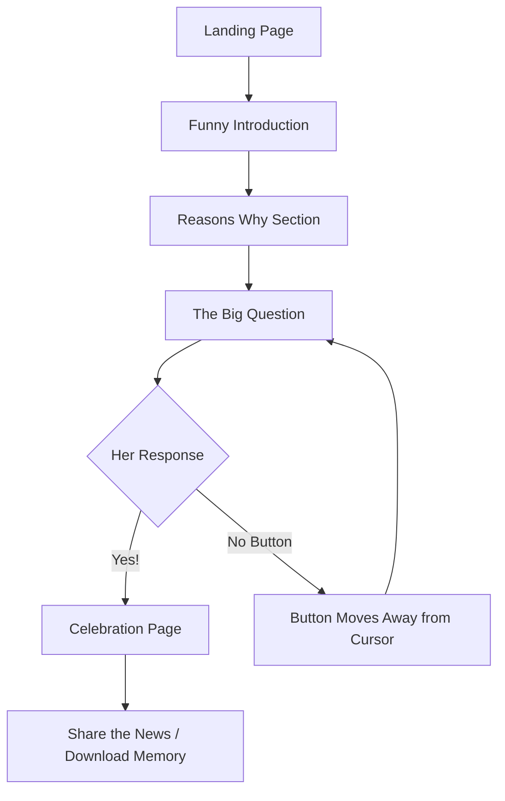

# Valentine's Day Proposal Website - Architecture Plan

## 🎯 Project Overview

A funny and unique Valentine's Day proposal website designed to surprise and delight your girlfriend with interactive elements, humor, and a heartfelt proposal. This will be a purely frontend application with no backend requirements.

---

## 🛠️ Technology Stack

### Core Technologies

#### **HTML5**
- Semantic markup for structure
- Meta tags for SEO and social sharing (when she shares the good news!)
- Responsive viewport configuration

#### **CSS3**
- **Vanilla CSS** for maximum control and creativity
- CSS animations and transitions for smooth, engaging effects
- CSS Grid and Flexbox for responsive layouts
- Custom properties (CSS variables) for theming
- Glassmorphism and modern design patterns

#### **JavaScript (ES6+)**
- Pure vanilla JavaScript - no frameworks needed
- Modular code organization
- Event-driven interactions
- Animation sequencing and timing control
- Local storage for fun features (e.g., tracking how many times she visited before saying yes)

### Why No Framework?

For a proposal website, we want:
- **Fast loading** - First impressions matter!
- **No dependencies** - Simple deployment and maintenance
- **Full creative control** - Custom animations and interactions
- **Lightweight** - Works perfectly on any device

---

## 🎨 UI/UX Design Concept

### Design Philosophy: "Funny First, Romantic Always"

The website will balance humor with heartfelt emotion, creating a memorable experience that reflects your unique relationship.

### Visual Design Elements

#### **Color Palette**
- **Primary**: Soft romantic colors (blush pink, rose gold)
- **Accent**: Playful colors (coral, lavender, mint)
- **Background**: Gradient backgrounds with subtle animations
- **Dark mode option**: For late-night viewing (because proposals can happen anytime!)

#### **Typography**
- **Headings**: Playful, bold fonts (e.g., Pacifico, Lobster from Google Fonts)
- **Body**: Clean, readable fonts (e.g., Inter, Poppins)
- **Special moments**: Handwriting-style fonts for personal touches

#### **Animations & Interactions**
- **Entrance animations**: Fade-ins, slide-ins, scale effects
- **Hover effects**: Playful micro-interactions
- **Particle effects**: Floating hearts, confetti on "Yes" click
- **Smooth scrolling**: Between sections for storytelling flow

### User Journey Flow



### Page Sections Breakdown

#### 1. **Landing Page**
- Eye-catching hero section
- Animated entrance (e.g., "Loading your surprise...")
- "Click to start" button with pulse animation

#### 2. **Funny Introduction**
- Light-hearted opening
- Sets the playful tone
- Smooth transition to next section

#### 3. **Reasons Why**
- Creative list presentation (not boring bullets!)
- Could be:
  - Animated cards that flip
  - Scrolling ticker
  - Interactive elements she can click
  - Mix of funny and sweet reasons

#### 4. **The Big Question**
- Dramatic build-up
- The proposal question prominently displayed
- Two buttons: "Yes!" and "No"

#### 5. **Interactive Button Logic** ⭐ Key Feature
- **Yes Button**: Large, easy to click, leads to celebration
- **No Button**: Simple evasive behavior:
  - **Moves away from cursor** when mouse gets close
  - Uses JavaScript mouse tracking for smooth movement
  - Repositions to random location on the screen when approached

#### 6. **Celebration Page**
- Confetti animation
- Romantic message
- Fireworks or heart explosion effect
- Option to download a certificate/memory
- Share buttons (optional)

### Responsive Design

- **Mobile-first approach**: Most people check their phones constantly
- **Tablet optimization**: Looks great on iPads
- **Desktop enhancement**: Full experience with more screen real estate
- **Touch-friendly**: All interactive elements easily tappable

### Accessibility Considerations

- Proper contrast ratios
- Keyboard navigation support
- Screen reader friendly (just in case!)
- Reduced motion option for accessibility preferences

---

## 📁 Project Structure

```
valentines-proposal/
├── index.html              # Main HTML file
├── css/
│   ├── styles.css          # Main stylesheet
│   ├── animations.css      # Animation definitions
│   └── responsive.css      # Media queries
├── js/
│   ├── main.js             # Main application logic
│   ├── animations.js       # Animation controllers
│   └── interactions.js     # User interaction handlers
├── assets/
│   ├── images/             # Generated or personal images
│   ├── fonts/              # Custom fonts (if not using CDN)
│   └── sounds/             # Optional: romantic background music
└── README.md               # Deployment instructions
```

---

## 🚀 Deployment Strategy

### Recommended Platforms (All Free!)

#### **Option 1: GitHub Pages** ⭐ Recommended
**Pros:**
- Completely free
- Easy version control
- Custom domain support
- HTTPS by default
- Simple deployment process

**Steps:**
1. Create a GitHub repository
2. Push your code to the repository
3. Go to Settings → Pages
4. Select branch (usually `main`) and folder (`/root`)
5. Your site will be live at `https://yourusername.github.io/repo-name`

**Custom Domain (Optional):**
- Purchase a romantic domain (e.g., `willyoumarryme-[yournames].com`)
- Configure DNS settings
- Add CNAME file to repository

#### **Option 2: Netlify**
**Pros:**
- Drag-and-drop deployment
- Automatic HTTPS
- Continuous deployment from Git
- Form handling (if you want to capture her response)
- Instant rollbacks

**Steps:**
1. Sign up at netlify.com
2. Drag your project folder to Netlify
3. Site is live instantly
4. Optional: Connect to GitHub for auto-updates

#### **Option 3: Vercel**
**Pros:**
- Lightning-fast deployment
- Excellent performance
- Preview deployments
- Analytics available

**Steps:**
1. Sign up at vercel.com
2. Import your GitHub repository
3. Deploy with one click
4. Site goes live immediately

#### **Option 4: Cloudflare Pages**
**Pros:**
- Global CDN
- Unlimited bandwidth
- Fast performance
- Free SSL

### Deployment Checklist

- [ ] Test on multiple devices (phone, tablet, desktop)
- [ ] Test on different browsers (Chrome, Safari, Firefox)
- [ ] Optimize images (compress for faster loading)
- [ ] Minify CSS and JavaScript (optional, for performance)
- [ ] Test all interactive elements
- [ ] Verify animations work smoothly
- [ ] Check responsive design at various screen sizes
- [ ] Add favicon (a heart icon!)
- [ ] Set up custom domain (optional)
- [ ] Test the "No" button behavior thoroughly (most important!)

### Performance Optimization

- **Lazy loading**: Load images as needed
- **CSS optimization**: Remove unused styles
- **JavaScript optimization**: Minimize and compress
- **Caching strategy**: Leverage browser caching
- **CDN usage**: For fonts and libraries

---

## 🎭 Unique & Funny Ideas to Consider

### Interactive Elements

1. **The Impossible "No" Button** ⭐ PRIMARY FEATURE
   - **Cursor Detection**: Tracks mouse position in real-time
   - **Evasive Movement**: Button moves away when cursor gets within a certain radius
   - **Technical Implementation**:
     - JavaScript `mousemove` event listener
     - Calculate distance between cursor and button
     - Use CSS `transform: translate()` for smooth movement
     - Random position generation within viewport bounds
   - Simple and effective - the button just keeps moving away!

2. **Progress Bar**
   - "Loading your future together... 99%"
   - Stuck at 99% until she clicks "Yes"

3. **Fake Error Messages**
   - "Error 404: Reason to say 'No' not found"
   - "Warning: Clicking 'No' will break developer's heart"

4. **Counter Display**
   - "You've visited this page X times"
   - "Days I've been waiting to ask: XXX"

5. **Easter Eggs**
   - Konami code triggers special animation
   - Secret messages in console for tech-savvy girlfriends
   - Hidden inside jokes throughout

### Storytelling Techniques

- **Timeline Animation**: Your relationship journey
- **Quiz Format**: "How well do you know us?" leading to proposal
- **Choose Your Own Adventure**: All paths lead to "Yes"
- **Fake Loading Screens**: Humorous loading messages
- **Meme Integration**: Inside jokes as memes

---

## 🔒 Privacy & Security

Since this is a personal proposal:

- **No analytics tracking**: Keep it private
- **No external data collection**: All client-side
- **Optional password protection**: Using Netlify/Vercel features
- **Unlisted/Private URL**: Share only with her

---

## 📱 Testing Strategy

### Pre-Launch Testing

1. **Device Testing**
   - Your phone (the one you'll send the link from)
   - Her phone type (iOS/Android)
   - Desktop browsers

2. **Network Testing**
   - Fast connection
   - Slow 3G (in case she's not on WiFi)

3. **User Testing**
   - Show a trusted friend (sworn to secrecy!)
   - Get feedback on humor and flow

### Launch Day Checklist

- [ ] Site is live and accessible
- [ ] All animations working
- [ ] Music/sounds working (if included)
- [ ] Mobile experience is perfect
- [ ] URL is easy to share
- [ ] You have a backup plan (just in case!)

---

## 🎯 Success Metrics

The only metric that matters: **She says YES!** 💍

---

## 📝 Next Steps

1. **Review this architecture plan**
2. **Decide on specific funny elements** you want to include
3. **Gather any personal photos or inside jokes** to incorporate
4. **Choose your deployment platform**
5. **Start building!**

---

## 💡 Final Tips

- **Keep it personal**: Include inside jokes only you two understand
- **Balance humor and heart**: Make her laugh, then make her cry (happy tears!)
- **Test thoroughly**: You only get one shot at this!
- **Have fun with it**: Your joy will show in the final product
- **Backup plan**: Have the ring ready regardless of technical issues!

---

**Good luck with your proposal! 🎉💕**

*Remember: The website is just the delivery method. Your love is what makes it special.*
